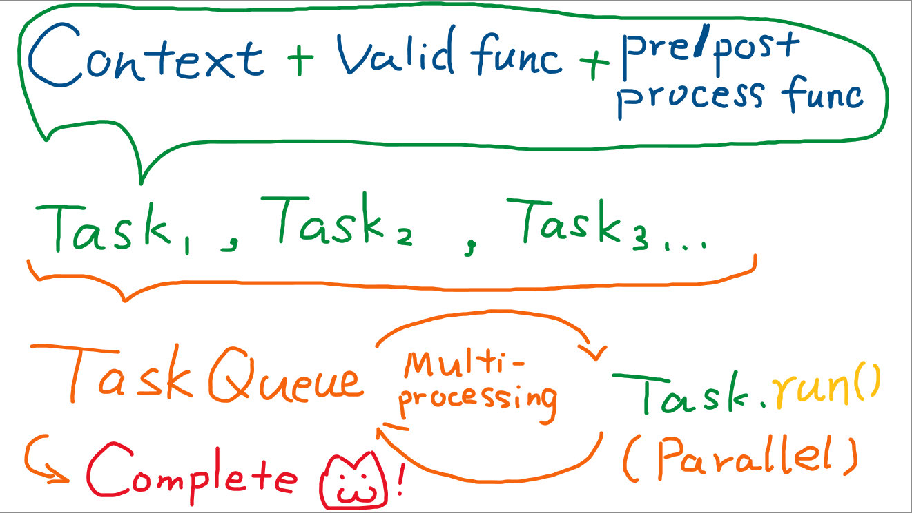

# OpenAI_PTCompletion
A Parallel Completion Library that boosts your OpenAI-API query with task queue &amp; multiprocessing.

# Installation
```pip install ptcompletion```

# Framework


# How to use
Check example.ipynb for usage.